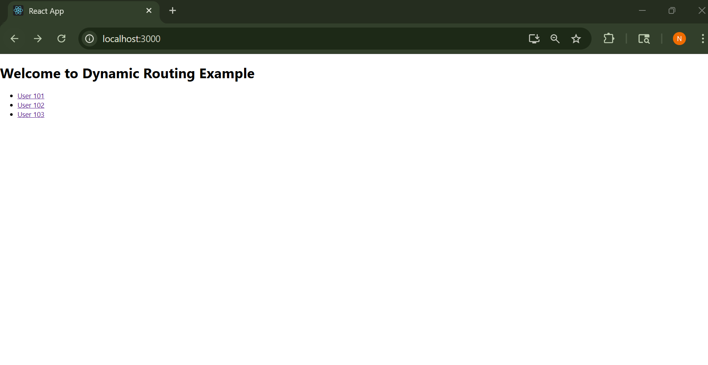

# Dynamic Routing in React

This project demonstrates the concept of **Dynamic Routing** using React Router. It allows users to navigate between different user profiles based on dynamic URL parameters.

---

## Project Structure

---

##  Features

- `useParams()` to capture dynamic route params
- Routing using `react-router-dom`
- Navigation with `<Link>`
- Clean component structure
- Screenshot included for reference

---

##  Screenshot



---

## ▶Run the Project

```bash
# Clone the repository
git clone https://github.com/tnikhilchowdary/dynamic-routing.git
cd dynamic-routing

# Install dependencies
npm install

# Start the app
npm start


